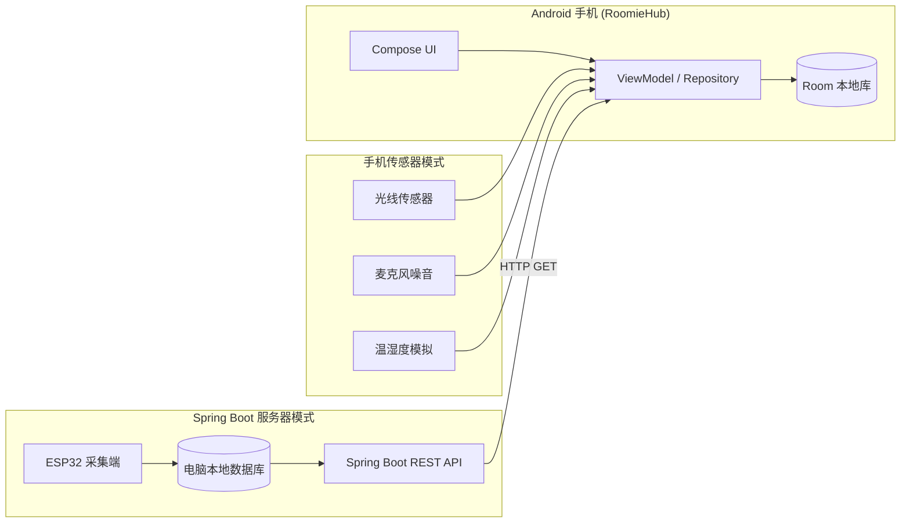

# RoomieHub

**RoomieHub** 是一款面向大学生宿舍场景的环境监测与健康管理应用。项目基于前期问卷调研中收集到的真实宿舍生活需求进行设计，旨在帮助宿舍成员更好地了解宿舍环境状况，改善作息习惯，减少因信息不对称和沟通不足产生的矛盾。

系统采用Android客户端、Spring Boot后端服务与ESP32硬件设备相结合的方案，实现环境数据采集、健康评分、趋势分析、健康报告和智能提醒等功能。用户既可以通过手机传感器体验系统功能，也可以通过ESP32采集真实环境数据，完成对宿舍环境的持续监测与分析。

> 包名：`com.dorm.health` · 最低 Android 8.0 (API 26) · 当前版本 `1.0`

---

## 目录

- [系统架构](#系统架构)
- [功能说明](#功能说明)
- [技术栈](#技术栈)
- [运行环境](#运行环境)
- [快速开始](#快速开始)
- [用户端登录（演示）](#用户端登录演示)
- [数据采集模式](#数据采集模式)
- [健康评分算法](#健康评分算法)
- [Spring Boot 接口约定](#spring-boot-接口约定)
- [服务器连接指南](#服务器连接指南)
- [权限说明](#权限说明)
- [主题与 UI](#主题与-ui)
- [项目结构](#项目结构)
- [本地数据库](#本地数据库)
- [常见问题](#常见问题)
- [已知限制与后续计划](#已知限制与后续计划)

---

## 系统架构

整体数据流分为两条路径：**手机本地采集** 与 **电脑端中转**。



| 组件 | 职责 |
|------|------|
| **ESP32** | 在宿舍部署，采集温湿度、噪音、光照、AQI 等，写入电脑端数据库 |
| **Spring Boot** | 运行在电脑上，对外提供 REST API，供手机拉取最新数据与历史记录 |
| **RoomieHub APP** | 展示实时环境、健康评分、图表与报告；数据持久化到 Room |

手机与电脑须处于**同一局域网（WiFi）**，APP 通过 HTTP 访问电脑的局域网 IP（如 `192.168.1.100:8080`）。

---

## 功能说明

### 登录页

- 启动后若未登录，进入 **RoomieHub · 用户端** 登录界面
- 支持手动输入学号/用户名 + 密码，或点击演示账号一键登录
- 登录成功后自动同步昵称与宿舍信息到本地

### 首页

| 模块 | 说明 |
|------|------|
| 欢迎语 | 显示「你好，{昵称}（{宿舍}）」 |
| 宿舍信息卡 | 宿舍名称、成员数、当前数据源模式 |
| 环境数据网格 | 温度、湿度、噪音、光照、AQI 实时数值 |
| 健康评分环 | 综合分 + 作息 / 舒适度 / 噪音 / 空气 四维子分 |
| 智能建议 | 根据当前环境自动生成提示（如噪音过高、熬夜警告） |
| 快捷入口 | 跳转「数据分析」「健康报告」 |
| 下拉刷新 | 手动刷新最新数据（服务器模式下会同步近 7 天历史） |

### 数据分析

- 历史折线图：温度、湿度、噪音、光照、AQI 随时间变化
- 雷达图：健康维度分布
- 时间范围切换：日 / 周 / 月
- 数据来源于 Room 本地库（手机模式持续写入；服务器模式同步后写入）

### 健康报告

- 每日自动生成健康报告摘要
- 展示近一周报告列表
- 包含平均评分、预估就寝时间、夜间噪音次数、空气质量均值、趋势描述等

### 我的

| 功能 | 说明 |
|------|------|
| 用户端账号 | 学号、用户名、床位、宿舍；支持退出登录 |
| 数据源模式 | 手机传感器 / Spring Boot 服务器 切换 |
| 服务器连接 | 配置 IP、端口，测试连接，保存并启用 |
| 宿舍设置 | 修改宿舍名称、昵称 |
| 外观 | 跟随系统 / 浅色 / 深色 |
| 通知开关 | 控制环境异常与熬夜提醒 |
| 刷新间隔 | 数据采集轮询间隔（默认 5 秒） |

---

## 项目特色

* Android客户端与ESP32硬件设备协同运行，实现软硬件结合的宿舍环境监测方案；
* 支持手机传感器模式与ESP32服务器模式两种运行方式，便于演示与实际部署；
* 提供健康评分、趋势分析和智能建议功能，帮助用户更加直观地了解宿舍环境状况；
* 面向真实大学生宿舍场景设计，功能需求来源于前期问卷调研结果，具有较强的实际应用价值。

---

## 技术栈

| 类别 | 技术 |
|------|------|
| 语言 | Kotlin |
| UI | Jetpack Compose + Material 3 |
| 架构 | MVVM |
| 本地存储 | Room + KSP |
| 异步 | Coroutines + Flow + StateFlow |
| 网络 | OkHttp 4.12（访问 Spring Boot REST API） |
| 图表 | Vico 1.13 |
| 其他 | Navigation Compose、Coil（头像）、Accompanist（权限 / 下拉刷新） |

主要版本：`compileSdk 34` · `minSdk 26` · `targetSdk 33` · JDK 17

---

## 运行环境

| 项目 | 要求 |
|------|------|
| IDE | Android Studio Hedgehog 或更高 |
| JDK | 17（推荐）；若使用 JDK 21+ 请确保 Gradle 8.11+ |
| 设备 | 真机（推荐，需麦克风与光线传感器）或模拟器 API 26+ |
| 网络 | 服务器模式需手机与电脑同一 WiFi |

---

## 快速开始

### 1. 克隆并打开项目

```bash
# 用 Android Studio 打开项目根目录（含 settings.gradle.kts 的目录）
```

等待 Gradle Sync 完成。若遇到 `R defined multiple times`、`*_0 2.jar` 或 `Type ... is defined multiple times`（含 `* 2.dex`）类冲突，删除 `app/build` 目录后 **Clean Project → Rebuild Project**（多为 macOS 在构建目录生成重复文件导致）。

### 2. 运行 APP

1. 连接真机或启动模拟器
2. 点击 Run ▶
3. 首次启动会请求**麦克风**、**通知**权限（用于噪音采集与异常提醒）

### 3. （可选）连接 Spring Boot

1. 在电脑上启动 Spring Boot 服务（见 [接口约定](#spring-boot-接口约定)）
2. 确认浏览器可访问 `http://<电脑IP>:8080/api/latest`
3. APP → **我的 → 服务器连接** → 填写 IP 与端口 → **测试 Spring Boot 连接** → **保存并启用服务器模式**

### 4. 登录演示账号

见下方 [用户端登录（演示）](#用户端登录演示)。

---

## 用户端登录（演示）

当前为**假用户端**，登录逻辑在本地 `MockAuthRepository` 中，**不连接真实后端账号系统**。登录状态保存在 SharedPreferences，重启 APP 会自动恢复会话。

| 用户名 | 学号 | 昵称 | 宿舍 | 床位 | 密码 |
|--------|------|------|------|------|------|
| zhangsan | 2024001001 | 张三 | 6号楼302 | 302-A | 123456 |
| lisi | 2024001002 | 李四 | 6号楼302 | 302-B | 123456 |
| wangwu | 2024002008 | 王五 | 7号楼105 | 105-A | 123456 |

- 用户名或学号均可作为登录名
- 登录后首页显示欢迎语，「我的」页展示账号信息并可退出

---

## 数据采集模式

### 手机传感器模式（默认）

| 数据项 | 来源 |
|--------|------|
| 光照 (lux) | 手机光线传感器；无传感器时使用默认值 |
| 噪音 (dB) | 麦克风 RMS 估算 |
| 温度 / 湿度 | 无硬件时自动**模拟平滑数据**（标记 `isSimulated = true`） |
| AQI | 根据噪音、湿度、光照综合估算虚拟 AQI |

- 前台服务 `SensorService` 持续轮询（间隔可在「我的」中配置，默认 5 秒）
- 每条记录写入 Room，并参与健康评分与熬夜检测

### Spring Boot 服务器模式

| 步骤 | 说明 |
|------|------|
| 1 | 手机 HTTP 请求 `GET /api/latest`（或 `/api/environment/latest`） |
| 2 | 解析 JSON 得到 `EnvironmentSnapshot` |
| 3 | 首次启用时同步近 **7 天** 历史到本地 Room |
| 4 | 按相同间隔轮询最新数据 |

- 电脑端数据通常来自 ESP32 → 本地数据库 → Spring Boot 查询接口
- 连接状态：`未连接` / `连接中` / `已连接` / `连接失败`
- 断网时 APP 会 Toast 提示检查局域网

---

## 健康评分算法

评分由 `ScoreCalculator` 计算，基于近 **1 小时** 的环境记录：

| 维度 | 计算逻辑（摘要） |
|------|------------------|
| **作息 (sleep)** | 22:00–06:00 时段内熬夜事件占比；熬夜时总分 ×0.8 惩罚 |
| **舒适度 (comfort)** | 温度偏离 24°C、湿度偏离 55% 的惩罚 |
| **噪音 (noise)** | 平均 dB 分档：≤40 优秀，≤55 良好，≤70 一般，>70 较差 |
| **空气 (air)** | 平均 AQI 分档：≤50 优，≤100 良，≤150 轻度，>150 重度 |

**等级划分：**

| 总分 | 等级 |
|------|------|
| ≥ 85 | 优秀 |
| ≥ 70 | 良好 |
| ≥ 55 | 一般 |
| < 55 | 需改善 |

**熬夜检测 (`NightOwlDetector`)：** 在深夜时段若光照、噪音超过阈值，标记为熬夜并可能触发通知（10 分钟内不重复提醒）。

**智能建议示例：** 噪音过高、AQI 差、温湿度异常、熬夜警告、深夜光照过强等。

---

## Spring Boot 接口约定

默认基址：`http://<host>:<port>`（APP 内默认 `192.168.1.100:8080`，可在设置中修改）。

### 接口列表

APP 会**按顺序尝试**兼容路径，任一成功即可：

| 用途 | 尝试路径 |
|------|----------|
| 健康检查 | `GET /api/health`、`GET /actuator/health` |
| 最新数据 | `GET /api/latest`、`GET /api/environment/latest` |
| 历史数据 | `GET /api/history?from={ms}&to={ms}`、`GET /api/environment/history?from={ms}&to={ms}` |

- `from` / `to` 为 Unix 毫秒时间戳
- 超时：连接 15s，读取 15s

### latest 响应格式

**直接对象：**

```json
{
  "temp": 23.5,
  "humi": 58.0,
  "noise": 45.2,
  "light": 120,
  "aqi": 85,
  "timestamp": 1710000000000
}
```

**Spring 常见包装（也支持）：**

```json
{
  "data": {
    "temp": 23.5,
    "humi": 58.0,
    "noise": 45.2,
    "light": 120,
    "aqi": 85,
    "timestamp": 1710000000000
  }
}
```

**字段别名：**

| 标准字段 | 可识别别名 |
|----------|------------|
| temp | temperature |
| humi | humidity |
| noise | decibel |
| light | lux |

### history 响应格式

**数组：**

```json
[
  {
    "temp": 23.5,
    "humi": 58.0,
    "noise": 45.2,
    "light": 120,
    "aqi": 85,
    "timestamp": 1710000000000
  }
]
```

**包装数组（也支持）：** 外层 JSON 的 `data` / `content` / `records` / `items` / `result` 字段。

### 健康检查响应

响应体包含 `ok` 或 `UP`（不区分大小写）即视为通过。

### Spring Boot 配置建议

```yaml
# application.yml 示例
server:
  port: 8080
  address: 0.0.0.0   # 允许局域网访问，勿仅绑定 127.0.0.1
```

确保防火墙放行对应端口；手机浏览器可先访问 `http://<IP>:8080/api/latest` 验证。

---

## 服务器连接指南

### 步骤

1. 电脑运行 Spring Boot，确认本机浏览器可访问 API
2. 查看电脑局域网 IP：
   - Windows：`ipconfig`
   - macOS / Linux：`ifconfig` 或 `ip addr`
3. 手机连接**同一 WiFi**
4. APP → **我的 → 服务器连接**
5. 输入 IP（如 `192.168.1.100` 或 `10.36.110.18`）和端口（如 `8080`）
6. 点击 **测试 Spring Boot 连接**
   - 成功：显示测试 URL、响应时间、数据预览
   - 失败：显示错误原因（HTTP 状态码、超时等）
7. 测试成功后点击 **保存并启用服务器模式**

### 模拟器访问本机

Android 模拟器访问宿主机请使用 **`10.0.2.2`** 代替 `127.0.0.1`。

### 测试连接逻辑

1. 先请求健康检查接口
2. 若未通过，再请求 latest 并尝试解析环境数据
3. 任一成功即判定连接成功

---

## 权限说明

| 权限 | 用途 |
|------|------|
| `INTERNET` | 访问 Spring Boot API |
| `ACCESS_NETWORK_STATE` | 检测网络是否可用 |
| `RECORD_AUDIO` | 手机模式下估算环境噪音 |
| `POST_NOTIFICATIONS` | 环境异常、熬夜提醒（Android 13+） |
| `FOREGROUND_SERVICE` | 后台持续采集环境数据 |
| `FOREGROUND_SERVICE_DATA_SYNC` | 前台服务类型声明 |

HTTP 明文流量已在 `network_security_config.xml` 中允许，便于局域网内访问未配置 HTTPS 的 Spring Boot。

---

## 主题与 UI

- **浅色模式：** 浅灰白渐变背景 + 深色文字（`#2D3436`）
- **深色模式：** 近黑渐变背景 + 浅色文字（`#ECEFF4`）
- 可在「我的 → 外观」选择：跟随系统 / 浅色 / 深色
- 卡片采用毛玻璃风格 `GlassCard`，自适应深浅色
- 大字体设备（系统字体缩放 ≥ 1.15）下，登录演示账号、服务器连接按钮等会自动改为纵向布局，避免文字重叠

---

## 项目结构

```
app/src/main/java/com/dorm/health/
├── DormHealthApp.kt              # Application 入口，全局单例
├── MainActivity.kt               # 权限、主题、导航宿主
├── di/
│   └── AppModule.kt              # 手动依赖注入（Repository、DataSource 等）
├── data/
│   ├── model/Models.kt           # 数据模型、枚举
│   ├── database/                 # Room 实体、DAO、AppDatabase
│   ├── datasource/
│   │   ├── PhoneSensorDataSource.kt   # 手机传感器采集
│   │   └── ServerDataSource.kt        # OkHttp 访问 Spring Boot
│   └── repository/
│       ├── EnvironmentRepository.kt   # 环境数据核心逻辑
│       ├── MockAuthRepository.kt      # 演示登录
│       ├── UserRepository.kt
│       └── ReportRepository.kt
├── service/
│   └── SensorService.kt          # 前台采集服务
├── ui/
│   ├── navigation/NavGraph.kt    # 登录门控 + 底部 Tab 导航
│   ├── theme/                    # Material 3 主题、颜色、字体
│   ├── components/               # 通用组件（GlassCard、背景等）
│   └── screens/
│       ├── auth/                 # 登录
│       ├── home/                 # 首页
│       ├── analytics/            # 数据分析
│       ├── report/               # 健康报告
│       ├── profile/              # 我的
│       └── serverconnection/     # 服务器连接
└── utils/
    ├── PreferencesManager.kt     # SharedPreferences 封装
    ├── ScoreCalculator.kt        # 健康评分
    ├── NightOwlDetector.kt       # 熬夜检测
    ├── NotificationHelper.kt     # 通知渠道
    └── NetworkMonitor.kt         # 网络状态
```

---

## 本地数据库

Room 数据库文件：`dorm_health.db`

| 表名 | 说明 |
|------|------|
| `environmental_records` | 环境采样记录（温湿度、噪音、光照、AQI、是否熬夜） |
| `daily_reports` | 每日健康报告 |
| `dorm_info` | 宿舍信息、当前传感器模式 |
| `user_info` | 用户昵称、头像 |
| `night_owl_events` | 熬夜事件记录 |

SharedPreferences：`dorm_health_prefs`（服务器地址、模式、登录用户、主题等）

---

## 常见问题

### 测试连接失败

| 可能原因 | 处理方式 |
|----------|----------|
| IP 或端口错误 | 核对电脑 IP，确认 Spring Boot 端口 |
| 不在同一 WiFi | 手机与电脑连同一局域网 |
| Spring Boot 只监听 localhost | 设置 `server.address=0.0.0.0` |
| 防火墙拦截 | 放行 8080（或实际端口） |
| 接口路径不匹配 | 实现 `/api/latest` 或 `/api/environment/latest` |
| 模拟器访问本机 | 使用 `10.0.2.2` 而非 `127.0.0.1` |

### 连上但无数据

- 检查 latest 接口返回 JSON 是否包含 `temp`/`humi`/`noise`/`light`/`aqi`/`timestamp`
- 查看 APP 内测试结果卡的「数据预览」

### 手机模式温湿度不准

- 手机无温湿度硬件，该模式下温湿度为**模拟数据**，仅用于演示
- 真实温湿度请使用 **Spring Boot + ESP32** 模式

### 图标或名称未更新

- 重新安装 APK，或卸载旧版后再安装
- 部分启动器需清除缓存才刷新图标

### Gradle 构建报错 duplicate R / jar / dex

典型报错示例：

```
Type com.dorm.health.ui.screens.profile.ComposableSingletons$ProfileScreenKt$lambda-11$1 is defined multiple times:
.../lambda-11$1 2.dex, .../lambda-11$1.dex
```

**原因：** macOS 在 `app/build` 里生成了带 ` 2` 后缀的重复产物（如 `xxx 2.dex`），与正常文件同时参与打包，并非源代码写错。

**处理：**

```bash
rm -rf app/build
```

然后在 Android Studio：**Build → Clean Project → Rebuild Project**。

**预防：** 构建过程中不要用 Finder 复制项目文件夹；若项目放在 iCloud 同步目录，建议排除 `app/build` 或移出 iCloud。

---

## 已知限制与后续计划

| 项目    | 说明                          |
| ----- | --------------------------- |
| 登录系统  | 当前采用本地模拟账号，尚未接入真实用户认证与数据库管理 |
| 宿舍协同  | 尚未实现多用户加入同一宿舍及成员状态同步功能      |
| 睡眠管理  | 功能已完成设计，仍在开发过程中             |
| 值日管理  | 功能已完成设计，仍在开发过程中             |
| 传感器精度 | 亮度与噪音传感器仍需进一步校准优化           |
| 数据同步  | 当前数据主要存储于本地设备，暂未实现云端同步      |

后续将重点完善宿舍协同管理、睡眠管理和值日管理等功能，并进一步优化硬件数据采集精度和系统整体稳定性。

